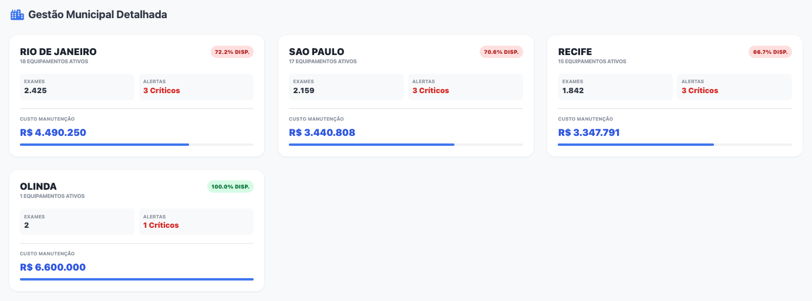
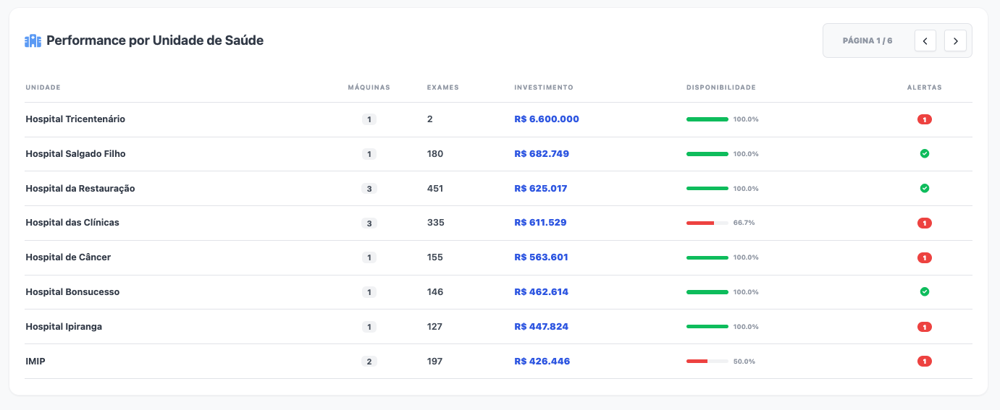
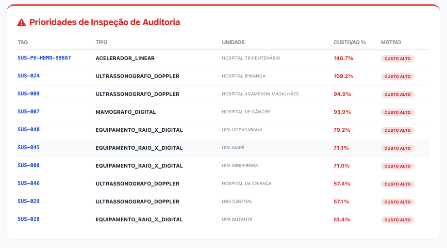
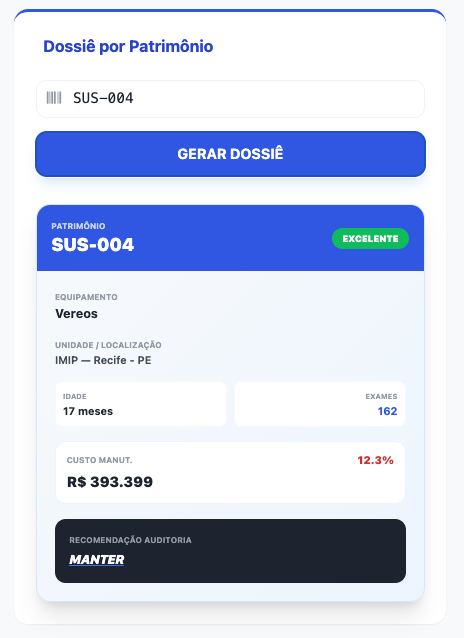

# EquipMed - Transparência e Eficiência na Gestão de Ativos de Alto Custo do SUS

O **EquipMed** é um ecossistema de microserviços de alta complexidade desenvolvido como projeto de Hackathon para a conclusão da **Pós-Graduação em Arquitetura e Desenvolvimento Java**. A solução visa preencher uma lacuna crítica na gestão da saúde pública brasileira: a governança sobre o ciclo de vida, a integridade financeira das manutenções e a produtividade real de equipamentos médicos de alto valor.

---

## 1. Visão do Produto e Motivação Estratégica

Atualmente, o Sistema Único de Saúde (SUS) gerencia um dos maiores parques tecnológicos do mundo. No entanto, o acompanhamento desses ativos ocorre frequentemente em **silos de dados isolados**, focando apenas no cadastro burocrático ou na entrega da obra física, negligenciando a **operação contínua e a eficiência econômica**.

### 1.1. Os Desafios do Setor Público

* **"Caixa Preta" na Manutenção:** Ausência de alertas quando o custo acumulado de manutenção de um equipamento supera seu valor de aquisição (Ponto de Equilíbrio Econômico).
* **Equipamentos "Fantasmas":** Máquinas cadastradas como "Ativas" no sistema nacional, mas que não registram produtividade clínica real por meses.
* **Ineficiência na Tomada de Decisão:** Falta de dados consolidados sobre a confiabilidade de fabricantes para embasar processos licitatórios.
* **Drenagem de Recursos:** Verbas destinadas à saúde sendo consumidas por contratos de manutenção desvantajosos em equipamentos tecnicamente obsoletos.

---

## 2. O Domínio SUS: Integração e Complementaridade

Para garantir a eficácia da auditoria, o EquipMed foi desenhado para interagir (ou complementar) os pilares de dados da saúde pública:

* **SCNES (Cadastro Nacional de Estabelecimentos de Saúde):** O EquipMed atua como uma camada de monitoramento vivo sobre esta base, que hoje é meramente declaratória.
* **SISMOB (Sistema de Monitoramento de Obras):** O acompanhamento do EquipMed inicia onde o SISMOB termina: no ciclo de vida operacional pós-instalação.
* **SIGTAP (Tabela de Procedimentos do SUS):** O "Catálogo de Serviços" do SUS. O EquipMed utiliza o SIGTAP como **validador de produtividade**. Se um equipamento não gera registros SIGTAP compatíveis com sua natureza técnica, o sistema sinaliza ociosidade.

---

## 3. Escopo de Ativos e Inteligência de Domínio

O sistema foca em equipamentos de alta complexidade. Cada categoria possui uma **Matriz de Compatibilidade SIGTAP**, impedindo erros de lançamento ou fraudes.

| Categoria | Valor Médio | Finalidade Técnica | Família de Procedimentos SIGTAP |
| --- | --- | --- | --- |
| **Acelerador Linear** | R$ 4.500.000 | Radioterapia Oncológica | **03.04.01.xxx** (Oncologia) |
| **PET-CT** | R$ 8.000.000 | Medicina Nuclear Avançada | **02.08.08.xxx** (PET Scan) |
| **Ressonância Magnética** | R$ 3.500.000 | Imagem de Alta Definição | **02.08.09.xxx** (RM) |
| **Tomógrafo** | R$ 1.200.000 | Diagnóstico Seccional | **02.06.01.xxx** (TC) |
| **Angiógrafo** | R$ 2.000.000 | Cardiologia Intervencionista | **02.11.02.xxx** (Hemodinâmica) |

---

## 4. Arquitetura Técnica Detalhada

O ecossistema adota o padrão de **Microservices Architecture**, utilizando tecnologias de ponta do ecossistema Spring e Java 21.

### 4.1. Componentes e Responsabilidades

#### **A. API Gateway (The Guardian)**

* **Tecnologia:** Spring Cloud Gateway.
* **Função:** Ponto único de entrada (Porta 8080). Gerencia o roteamento e implementa o **Filtro de API Key**.
* **Segurança:** Valida a `X-API-KEY` contra um registro interno de Unidades de Saúde e injeta Headers de jurisdição (`X-Unidade-Nome`, `X-Unidade-Cidade`) para os serviços internos.

#### **B. MS-Equipamentos (Inventory Manager)**

* **Responsabilidade:** Detentor da "verdade" sobre o ativo fixo.
* **Endpoints de Destaque:**
* `POST /api/equipamentos`: Cadastro com validação de jurisdição (Double-Check).
* `PATCH /{id}/status`: Transição de estados operacionais.


* **Persistência:** PostgreSQL 16.

#### **C. MS-Operacional (Event Engine)**

* **Responsabilidade:** Motor de alta transacionalidade para registros de **Uso** e **Manutenção**.
* **Inteligência de Domínio:** Bloqueia registros de SIGTAP incompatíveis com o tipo de equipamento (Ex: impede Raio-X em Tomógrafo).
* **Integração:** Fornece resumos em lote (Batch-Summary) para o agregador de transparência.

#### **D. MS-Transparencia (Aggregator & BI)**

* **Responsabilidade:** Consolidação de indicadores e exposição pública.
* **Performance:** Implementa **Cache com Redis** para os endpoints de Dashboard, reduzindo o tráfego inter-serviços.
* **Recurso de Auditoria:** Gera o **Dossiê de Auditoria** (Ficha completa com histórico e recomendação técnica).

---

## 5. Governança e Segurança Reativa

Diferente de sistemas comuns de inventário, o EquipMed foi projetado com camadas de proteção de dados:

* **Validação de Jurisdição:** O sistema garante que o Hospital A jamais consiga registrar usos para o Hospital B, mesmo que conheça o ID do equipamento, pois a `X-API-KEY` atrela a requisição a uma jurisdição fixa via Gateway.
* **Tratamento de Exceções Global:** Implementação de `ControllerAdvice` para converter erros internos em respostas de negócio claras (Status 400/403), facilitando o debug e a auditoria.

---

## 6. Stack Tecnológica

* **Java 21:** Uso intensivo de **Records** para imutabilidade de DTOs e **Virtual Threads** para escalabilidade.
* **Spring Boot 3.3.x:** Base de todos os microserviços.
* **Redis:** Utilizado como camada de cache para o portal público de transparência.
* **PostgreSQL:** Persistência relacional com forte integridade referencial.
* **OpenFeign:** Comunicação declarativa entre os serviços internos.
* **Docker & Docker Compose:** Orquestração completa do ambiente com 7 containers.

---

## 7. Data Seeding e Automação de Massa (Super Massa)

O sistema implementa uma estratégia de **Carga Dinâmica via CommandLineRunner**. Ao subir o ambiente, o sistema:

1. Lê arquivos JSON com modelos reais de equipamentos e códigos SIGTAP.
2. Gera dados para os polos de **Recife, Rio de Janeiro e São Paulo**.
3. Calcula datas retroativas de aquisição para simular equipamentos de diferentes idades.
4. Injeta **manutenções críticas propositais** (ex: R$ 2.2M em Olinda) para que o avaliador veja os alertas de auditoria funcionando imediatamente no Dashboard.

---

## 8. Infraestrutura (Docker Compose)

O arquivo `docker-compose.yml` orquestra:

* **4 Microserviços Java** (Gateway, Equipamentos, Operacional, Transparência).
* **2 Databases** (PostgreSQL e Redis).
* **1 Frontend (Nginx)**: Servindo o Dashboard de Auditoria.
* **Rede Isolada:** `equipmed_network` para comunicação interna segura.

### Como Rodar:

```bash
# Na raiz do projeto
docker compose up --build -d

```

Acesse: `http://localhost` (Dashboard) ou `http://localhost:8080` (Gateway).

---

## 9. Visão de Futuro: IA e Preditividade

A "Super Massa" de dados gerada pelo EquipMed (Idade x Frequência de Uso x Custo de Falha) é o alicerce para:

* **Manutenção Preditiva:** Antecipar falhas críticas baseado em padrões de uso intenso.
* **Ranking de Confiabilidade:** Score público para fabricantes que exigem menos manutenções corretivas.

## 7. Detalhamento de Domínio e Entidades (ERD)

A modelagem de dados foi desenhada para garantir a rastreabilidade total do ativo. Cada microserviço gerencia seu próprio esquema (Database per Service), garantindo o desacoplamento.

### 7.1. MS-Equipamentos (Persistência: PostgreSQL)

* **Equipamento (`equipamentos`):**
    * `id` (UUID, PK): Identificador único global.
    * `tagPatrimonio` (String, Unique): Código de inventário SUS.
    * `tipo` (Enum): Categoria (TOMOGRAFO, ACELERADOR_LINEAR, etc).
    * `marca` (String): Fabricante do equipamento.
    * `modelo` (String): Modelo específico do equipamento.
    * `valorAquisicao` (BigDecimal): Custo de compra para cálculo de ROI.
    * `dataAquisicao` (LocalDate): Data para cálculo de depreciação e idade.
    * `unidadeDeSaude` (String): Nome da unidade detentora (Validado via API KEY).
    * `cidade`/`estado` (String): Localização geográfica para agrupamento.
    * `fornecedor` (String): Empresa fornecedora do equipamento.
    * `status` (Enum): ATIVO, MANUTENCAO, OBSOLETO.

### 7.2. MS-Operacional (Persistência: PostgreSQL)

* **Uso (`usos`):**
    * `id` (UUID, PK): Identificador único do registro de uso.
    * `equipamentoId` (UUID, FK): Vínculo com o inventário.
    * `codigoSigtap` (String): Código do procedimento (Ex: 02.04.03.001-8).
    * `procedimentoNome` (String): Descrição do procedimento derivada do código SIGTAP.
    * `dataHora` (LocalDateTime): Timestamp do uso.
    * `operadorId` (String): Identificador do operador responsável.

* **Manutencao (`manutencoes`):**
    * `id` (UUID, PK): Identificador único da manutenção.
    * `equipamentoId` (UUID, FK): Vínculo com o inventário.
    * `tipo` (Enum): PREVENTIVA ou CORRETIVA.
    * `valor` (BigDecimal): Custo da intervenção.
    * `dataInicio` (LocalDate): Data de início da manutenção.
    * `dataFim` (LocalDate, nullable): Data de conclusão (null = em andamento).
    * `cnpjEmpresa` (String): CNPJ da empresa prestadora.
    * `nomeEmpresa` (String): Nome da empresa prestadora.
    * `descricao` (String): Descrição do serviço realizado.

## 8. Catálogo de Endpoints e Contratos (API Spec)

O sistema utiliza o **API Gateway (Porta 8080)** como orquestrador. Abaixo os contratos detalhados:

### 8.1. Gestão de Inventário (MS-Equipamentos)

| Método | Endpoint | Payload / Header | Regra de Negócio |
| --- | --- | --- | --- |
| **POST** | `/api/equipamentos` | `X-API-KEY` + JSON | Valida se a cidade/unidade no JSON coincide com o dono da Key. |
| **GET** | `/api/equipamentos` | QueryParams: `cidade`, `estado`, `tipo`, `unidadeDeSaude`, `status`, `page`, `size`, `sort` | Listagem paginada com filtros dinâmicos. Suporta ordenação customizada. |
| **GET** | `/api/equipamentos/{id}` | PathVariable: `id` (UUID) | Retorna os detalhes de um equipamento específico. |
| **GET** | `/api/equipamentos/patrimonio/{tag}` | PathVariable: `tag` (String) | Busca equipamento pelo código de patrimônio SUS. |
| **PATCH** | `/api/equipamentos/{id}/status` | `{ "status": "OBSOLETO" }` | Altera o status operacional do equipamento. |
| **PATCH** | `/api/equipamentos/{id}/localizacao` | `{ "cidade": "...", "estado": "..." }` | Atualiza a localização geográfica do ativo. |

### 8.2. Ciclo de Vida Operacional (MS-Operacional)

| Método | Endpoint | Descrição |
| --- | --- | --- |
| **POST** | `/api/operacional/usos` | Registra uso de equipamento com validação SIGTAP. |
| **POST** | `/api/operacional/manutencoes` | Registra manutenção com custo. |
| **GET** | `/api/operacional/usos/{equipamentoId}` | Lista histórico de usos por equipamento. |
| **GET** | `/api/operacional/manutencoes/{equipamentoId}` | Lista histórico de manutenções por equipamento. |
| **POST** | `/api/operacional/batch-summary` | Retorna resumo operacional em lote (integração MS-Transparência). |

### 8.3. Painel de Transparência (MS-Transparencia)

*Todos os endpoints de transparência utilizam cache **Redis** com TTL de 10 minutos.*

| Método | Endpoint | Retorno | Objetivo |
| --- | --- | --- | --- |
| **GET** | `/api/transparencia/sumario` | `PainelResumoDTO` | Visão macro: % Disponibilidade, Investimento Total e Máquinas Paradas. |
| **GET** | `/api/transparencia/alertas` | `List<EquipamentoDTO>` | Retorna apenas ativos com "Custo de Manutenção > 50% do Valor de Compra". |
| **GET** | `/api/transparencia/auditoria/{tag}` | `FichaAuditoriaDTO` | **Dossiê Técnico:** Consolida Uso + Gasto + Recomendação (Manter ou Trocar). |

---

## 9. Arquitetura de Integração (Inter-service Communication)

O projeto evita o acoplamento forte através de padrões de resiliência:

1. **OpenFeign:** O `ms-transparencia` atua como um agregador. Ele não possui os dados, ele os solicita em tempo real.
2. **DTOs de Integração:** O `ms-operacional` fornece o endpoint `/batch-summary`, que permite ao agregador buscar dados de múltiplos equipamentos em uma única chamada de rede, evitando o problema de *N+1 queries* no microserviço.
3. **Circuit Breaker (Conceitual):** Caso o `ms-operacional` esteja fora, o `ms-transparencia` serve os dados de inventário com os indicadores operacionais zerados, mantendo a disponibilidade parcial do portal (Graceful Degradation).

---

## 10. Lógica de Autopopulação (A "Super Massa")

A automação de dados foi construída para simular 2 anos de operação em segundos:

1. **Carga de Equipamentos:** Criação de 15 ativos de alto custo (Aceleradores, Tomógrafos, PET-CT) em Olinda, Recife e Rio de Janeiro.
2. **Carga de Produtividade:** Geração de ~1.000 registros de uso usando códigos SIGTAP reais (`03.04.01.026-6`, `02.08.09.001-0`).
3. **Injeção de Alertas:**
* **Cenário A:** Equipamento com 0 usos nos últimos 30 dias (Gera alerta de **OCIOSIDADE**).
* **Cenário B:** Manutenção de R$ 2.500.000 em um acelerador de R$ 4.500.000 (Gera status **CRÍTICO / REVISAR CONTRATO**).

---

## 11. Segurança e Filtros do Gateway

O **API Gateway** não é apenas um proxy, ele é uma camada de inteligência:

* **Filtro Global de API Key:** Intercepta todas as rotas `/api/equipamentos/**` e `/api/operacional/**`.
* **Enriquecimento de Contexto:** Busca a chave no `api-keys.json` e injeta os headers `X-Unidade-Nome` e `X-Unidade-Cidade`. Isso permite que os microserviços de backend sejam **stateless** e ignorantes quanto à forma de autenticação, focando apenas na validação da informação recebida no header.

---

## 12. Interface de Transparência (Frontend)

O Frontend do **EquipMed** foi concebido como uma SPA (Single Page Application) de alta performance, utilizando **Tailwind CSS** para uma interface responsiva e **Vanilla JavaScript** para garantir um consumo leve e direto das APIs, sem sobrecarga de frameworks.

### 12.1. Camada de Integração e Consumo

A interface comunica-se exclusivamente com o **API Gateway (Porta 8080)**. Embora os dados venham de microserviços distintos, o Frontend consome a agregação de inteligência do **MS-Transparencia**.

### 12.2. Seções do Portal e Vínculos de API

#### **A. Painel Executivo (Sumário)**

Localizado no topo da página, fornece os KPIs (Key Performance Indicators) globais do SUS para uma visão de nível ministerial.

* **Endpoint:** `GET /api/transparencia/sumario`
* **Dados Vinculados:** * `% Disponibilidade Geral`: Cálculo em tempo real do tempo de uptime das máquinas.
* `Investimento Total`: Soma histórica de manutenções registradas no `ms-operacional`.

```bash
curl -X GET http://localhost:8080/api/transparencia/sumario
```

<p align="left">
  
</p>

#### **B. Gestão Municipal Detalhada**

Apresenta cards dinâmicos para cada cidade monitorada (**Recife, São Paulo e Rio de Janeiro**).

* **Endpoint:** `GET /api/transparencia/cidades`
* **Inteligência Visual:** O sistema altera a cor dos badges e barras de progresso baseando-se no índice de produtividade e alertas críticos de cada município.

```bash
curl -X GET http://localhost:8080/api/transparencia/cidades
```

<p align="left">
  
</p>

#### **C. Performance por Unidade de Saúde (Grid Paginado)**

Uma tabela técnica que cruza os dados de inventário com a produtividade operacional.

* **Endpoint:** `GET /api/transparencia/unidades`
* **Data-Binding:** * **Exames:** Quantidade de registros SIGTAP processados pelo `ms-operacional`.
* **Alertas:** Contador de inconsistências financeiras detectadas pelo motor de auditoria.

```bash
curl -X GET http://localhost:8080/api/transparencia/unidades
```

<p align="left">
  
</p>

#### **D. Prioridades de Inspeção (Alertas Críticos)**

Tabela de alta visibilidade que destaca equipamentos com anomalias graves.

* **Endpoint:** `GET /api/transparencia/alertas`
* **Lógica de Negócio:** Filtra ativos onde o `percentualCustoSobreAquisicao` ultrapassa 50% ou equipamentos marcados como **ociosos** por falta de uso.

```bash
curl -X GET http://localhost:8080/api/transparencia/alertas
```

<p align="left">
  
</p>

#### **E. Dossiê por Patrimônio (Busca Técnica)**

Módulo de consulta individual que gera uma ficha completa do ativo.

* **Endpoint:** `GET /api/transparencia/auditoria/{tag}`
* **O que o Dossiê exibe:**
* **Status de Saúde:** (EXCELENTE, ALERTA, CRÍTICO).
* **Idade Técnica:** Calculada em meses desde a aquisição.
* **Recomendação de Auditoria:** Texto gerado pelo microserviço sugerindo a manutenção do contrato ou a substituição imediata do ativo.

```bash
curl -X GET http://localhost:8080/api/transparencia/auditoria/{tag}
```

<p align="left">
  
  
</p>

## 13. Governança e Segurança no Fluxo de Dados

A arquitetura garante que, embora o Portal de Transparência seja público, a integridade dos dados seja protegida:

1. **Read-Only Public Access:** O Portal consome apenas o `ms-transparencia`, que não possui métodos de escrita expostos ao público.
2. **CORS & Gateway:** Todas as chamadas passam pelo **API Gateway**, que atua como o mediador entre a rede do container Nginx e a rede interna dos microserviços.
3. **Cache Resilience:** O uso de **Redis** no backend de transparência garante que, mesmo sob alto volume de acessos públicos, a carga nos microserviços de escrita (`ms-equipamentos` e `ms-operacional`) permaneça baixa.

## 14. Testes e Validação (Postman Collection)

Para facilitar a validação das regras de negócio, contratos de API e o fluxo de governança via Gateway, disponibilizamos uma coleção completa de requisições **Postman**.

### 14.1. Como Utilizar

1. Certifique-se de que o ambiente Docker está rodando (`docker compose up`).
2. Importe o arquivo JSON da coleção (localizado em `/docs/postman/equipmed_collection.json`) para o seu Postman.
3. Todas as requisições estão configuradas para apontar para o **API Gateway (Porta 8080)**.

### 14.2. Estrutura da Coleção

A coleção está organizada em três pastas principais, refletindo a arquitetura de microserviços:

| Pasta | Descrição | Principais Recursos |
| --- | --- | --- |
| **Equipamentos** | Gestão do inventário técnico. | Cadastro (com `X-API-KEY`), listagem paginada e alteração de status. |
| **Operacional** | Registro de eventos de uso e custo. | Registro de uso (validação SIGTAP) e manutenções corretivas. |
| **Transparência** | Consumo de dados agregados. | Dashboards de cidades, unidades de saúde e o Dossiê de Auditoria por tag. |

### 14.3. Exemplo de Requisição com Segurança

Para os endpoints de escrita, o sistema exige a validação de jurisdição via Header. Exemplo de cadastro:

```http
POST /api/equipamentos
Content-Type: application/json
X-API-KEY: tri-olinda-key-456

{
  "tagPatrimonio": "SUS-051",
  "tipo": "ACELERADOR_LINEAR",
  "unidadeDeSaude": "Hospital Tricentenário",
  "cidade": "Olinda",
  "valorAquisicao": 4500000.00
}

```

> **Nota de Auditoria:** Se você tentar enviar uma `X-API-KEY` de Olinda para cadastrar um equipamento em Recife, o **API Gateway** e o **MS-Equipamentos** bloquearão a requisição com `403 Forbidden` ou `400 Bad Request`.

### 14.4. Dinâmica de Testes e UUIDs

Como o projeto utiliza UUIDs gerados aleatoriamente durante o *Data Seeding* (Super Massa), a coleção está preparada para trabalhar com **Postman Variables**:

1. **Captura Dinâmica:** Ao realizar um `GET /api/equipamentos`, recomendamos copiar o `id` de um equipamento gerado e atualizar a variável `{{equipamento_id}}` na sua coleção.
2. **Endpoints de Escrita:** Os exemplos de `POST` (Uso e Manutenção) utilizam essas variáveis para garantir que os registros operacionais sejam vinculados corretamente a ativos existentes no banco de dados daquela execução.
